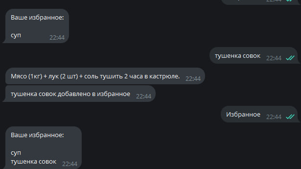

# Recipe - бот
## Содержание
- [Изменения](#изменения)
- [Как запустить](#как-запустить)
- [Что можно добавить](#что-можно-добавить)
- [Картинка](#картинка)
## Изменения: 
* создана база данных, которая содержит тг айди людей, блюда и избранное
* возможность сохранять блюдо в избранное
## что можно еще добавить?
* картинки блюд
* больше блюд
* удаление из избранного
## Как запустить?
Скачать репозторий и запустить файл tgBot.py
## Картинка:

